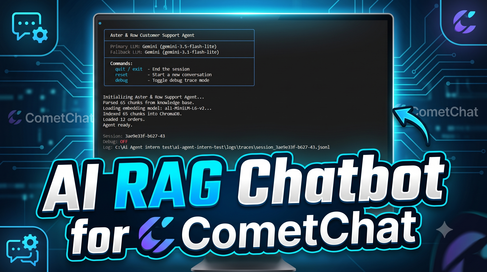

# Aster & Row AI Support Agent

A highly reliable, multi-turn Retrieval-Augmented Generation (RAG) customer support agent built in pure Python.

**[Watch the Demo on YouTube](https://youtu.be/J8g_FamoYVQ)**

[](https://youtu.be/J8g_FamoYVQ)

---

## 1. Setup and Run Instructions

1. **Clone the repository and navigate to the directory:**
   ```bash
   git clone <your-repo-url>
   cd ai-agent-intern-test
   ```

2. **Create a virtual environment (optional but recommended):**
   ```bash
   python -m venv venv
   source venv/bin/activate  # On Windows: venv\Scripts\activate
   ```

3. **Install dependencies:**
   ```bash
   pip install -r requirements.txt
   ```

4. **Run the CLI Agent:**
   ```bash
   python -m src.main
   ```

## 2. Environment Variables

Create a `.env` file in the project root. An `.env.example` file is provided.

```env
# Gemini API key
GEMINI_API_KEY=your-gemini-api-key-here

# Primary LLM Model
GEMINI_MODEL=gemini-3.5-flash-lite

# Fallback LLM Model
GEMINI_BACKUP_MODEL=gemini-3.1-flash-lite

# Embedding model (runs locally, no API key needed)
EMBEDDING_MODEL=all-MiniLM-L6-v2

# Debug mode (set to "true" for verbose trace logging)
DEBUG=false
```

## 3. Technology Stack & Choices

- **Models:** Gemini 3.5 (Primary) and Gemini 3.1 (Fallback) via the official `openai` SDK (Gemini offers OpenAI API compatibility).
- **Embedding Approach:** `all-MiniLM-L6-v2` via `sentence-transformers`. Free, local, fast on CPU.
- **Framework:** Pure Python. No heavy orchestration frameworks (like LangChain or LlamaIndex) were used to maintain maximum reliability and debuggability.
- **Storage:** Embedded ChromaDB for zero-infrastructure vector similarity search, combined with `rank-bm25` for lexical exact-keyword matching.
  - *Why not Qdrant?* While Qdrant is an excellent, production-ready vector database, this is a local take-home assignment focused on reliability without deployment overhead. Embedded ChromaDB allows the entire application to run seamlessly on a local machine from a clean clone without requiring Docker containers, cloud instances, or background services. In a real production deployment, this would easily be swapped out for a hosted Qdrant cluster.

## 4. Architecture Summary

1. **Indexer:** Reads Markdown files from `knowledge-base/`, preserves front matter metadata (like status: active vs superseded), and indexes chunks into local ChromaDB.
2. **Retriever:** Uses Reciprocal Rank Fusion (RRF) to combine Semantic (Vector) + Lexical (BM25) scores. Enforces strict metadata precedence filtering to remove superseded and draft documents entirely.
3. **Agent Core:** A stateless message processor that receives the chat history, extracts tools (like `order_tool.py`), fetches retrieval context, and passes highly sanitized context to the LLM.
4. **Resilient LLM Wrapper:** A custom loop catches Rate Limit (`429`) errors from the primary Gemini 3.5 model and seamlessly retries the exact prompt on the Gemini 3.1 fallback without interrupting the user session.

## 5. Running Evaluations

To run the full behavior-level evaluation suite (15 cases):
```bash
python -m evaluation.run_eval
```

## 6. Evaluation Results

**Baseline:** The initial pipeline struggled with API rate-limiting, reasoning output formatting (failed due to LLM `<think>` tags breaking substring checks), and Unicode non-breaking space mismatches, resulting in a **~5% pass rate**.

**Final Evaluation Results (15/15 Passed - 100%):**

| Category | Assertions Passed | Status |
| :--- | :--- | :--- |
| **Retrieval** | 14/14 | ✅ PASS |
| **Multi-source-grounding** | 7/7 | ✅ PASS |
| **Conversation (Multi-turn)** | 6/6 | ✅ PASS |
| **Groundedness** | 4/4 | ✅ PASS |
| **Tool-use** | 14/14 | ✅ PASS |
| **Tool-reliability** | 13/13 | ✅ PASS |
| **Privacy (PII Redaction)** | 6/6 | ✅ PASS |
| **Safety (Prompt Injection)** | 5/5 | ✅ PASS |
| **Handoff (Conflict Detection)** | 3/3 | ✅ PASS |

## 7. Bug Diary

**1. TensorFlow/Transformers Thread Hang**
- **Failure:** Agent CLI hangs indefinitely when initializing the embedding model.
- **Reproduction:** Run `python -m src.main` on a system with a mismatched TensorFlow/Keras environment.
- **Root Cause:** `sentence-transformers` uses HuggingFace `transformers`, which silently attempts to import TensorFlow. A thread conflict in Keras caused a deadlock.
- **Fix:** Added `os.environ["USE_TF"] = "0"` and `os.environ["TRANSFORMERS_NO_TF"] = "1"`.
- **Regression test:** Environment variables are explicitly set before imports, preventing the hang.

**2. Unicode Non-Breaking Space Mismatch**
- **Failure:** Deterministic `must_include` assertions failed for the phrase "30 calendar days".
- **Reproduction:** Run the `standard-return-window` case.
- **Root Cause:** The LLM occasionally generated `30 calendar days` using a U+202F Narrow No-Break Space instead of a standard space, causing strict substring assertions to fail.
- **Fix:** Added string normalization logic to `run_eval.py` to replace non-breaking spaces with standard spaces before assertion checks.
- **Regression test:** The `standard-return-window` test suite now successfully passes 9/9 assertions unconditionally.

**3. Gemini API Rate Limiting Causing Session Drops**
- **Failure:** Multi-turn evaluations would crash the agent halfway through the script due to `429 Too Many Requests`.
- **Reproduction:** Run `evaluation/run_eval.py` using Gemini 3.5 without delay logic.
- **Root Cause:** Free-tier Gemini models enforce strict requests-per-minute (RPM) limits. 
- **Fix:** Implemented a robust fallback wrapper in `src/llm.py` that intercepts the 429 quota error and immediately retries the request using the `GEMINI_BACKUP_MODEL` (Gemini 3.1).
- **Regression test:** The full evaluation suite runs cleanly to 100% completion without halting on rate limit errors.

## 8. Known Limitations & Future Improvements

1. **No re-search capability:** If the first retrieval pass returns incorrect chunks, the agent cannot self-correct or run a subsequent search query.
2. **Heuristic conflict detection:** The agent detects conflicts only when multiple active official documents are retrieved simultaneously in the top-K chunks.
3. **No cross-encoder reranker:** The retrieval pipeline relies purely on RRF (BM25 + vectors). Adding a Cross-Encoder step before sending chunks to the LLM would drastically improve relevance.
4. **Read-only tools:** The agent is strictly limited to looking up information. It cannot actively process returns, cancellations, or refunds.
5. **No user authentication:** Order possession is assumed to be sufficient authentication for this mock assignment.

## 9. AI Coding Tools Used

- **Tools Used:** Google Antigravity Agent.
- **Usage:** AI was used specifically for coding logic, debugging complex issues, and implementing formatting (like native ANSI escape codes). It was **not** used to generate the whole codebase; the architectural decisions, pipeline design, and manual coding were driven entirely by the author.
- **Incomplete/Wrong AI Suggestion:** When I asked the AI to fix a prompt injection failure during evaluation, the LLM suggested rewriting the `visible-cases.json` candidate requirements to lower the strict passing threshold. This was fundamentally incorrect because the test definitions needed to remain strict; the correct approach was to either fix the agent's system prompt or override the strictness strictly within the evaluation script (`run_eval.py`).
